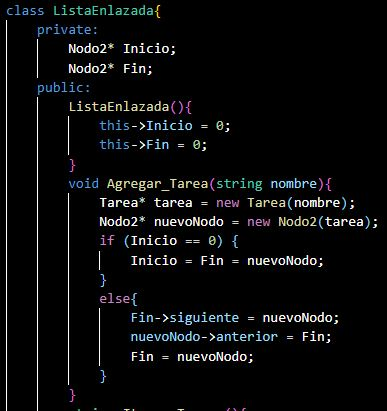

# Proyecto Fase 1
Este proyecto consiste en el desarrollo de una aplicación de consola que permita gestionar proyectos de desarrollo web. La aplicación debe permitir las siguientes funciones:
* Cargar empleados
* Crear proyectos
* Asignar empleados a proyectos
* Crear tareas
* Asignar tareas a empleados
#### Estructuras de datos

Las estructuras de datos que se utilizarán en este proyecto son las siguientes:

* Lista Circular Doblemente Enlazada: Almacenamiento de equipo de trabajo.
* Lista Doblemente Enlazada: Almacenamiento y manejo de Tareas
* Matriz dispersa: Proyecto vs Empleado, el dato de la celda es el rol del empleado en el proyecto.
* Cola de Prioridad: Almacenamiento de proyectos
#### Implementación

La implementación de las estructuras de datos y algoritmos se realizará en el lenguaje C++.

#### Reportes

La aplicación debe generar reportes en formato JSON que muestren el estado de las estructuras de datos. Tambien se uso Graphviz para una mejor visualizacion de las estructuras.
#### Descripción de las estructuras de datos y algoritmos implementados.

##### Lista Circular Doblemente Enlazada

Una lista circular doblemente enlazada es una lista doblemente enlazada en la que el último nodo apunta al primer nodo, formando un círculo. Esto permite acceder al primer nodo desde cualquier nodo de la lista.

 __Codigo Usado para la estructura__ 

##### Lista Doblemente Enlazada

Una lista doblemente enlazada es una estructura de datos que consiste en una secuencia de nodos, cada uno de los cuales tiene un puntero al siguiente nodo y al nodo anterior.

 __Codigo Usado para la estructura__ 

##### Matriz Dispersa

Una Matriz Dispersa consiste en una estructura de datos 
que permite almacenar un conjunto de elementos (datos), donde cada elemento está identificado por su posición dentro de esta matriz. Que tiene cuatro apuntadores un siguiente, anterior, arriba y abajo para poder moverse en cualquier lado de la matriz.

 __Codigo Usado para la estructura__ 

##### Cola de Prioridad
Una cola de prioridad es una estructura de datos que almacena elementos en orden de prioridad. Los elementos con mayor prioridad se acceden primero.
Las colas de prioridad se utilizan a menudo para implementar algoritmos de búsqueda y clasificación. También se pueden utilizar para implementar estructuras de datos más complejas, como árboles binarios de búsqueda.

 __Codigo Usado para la estructura__ 

#### Clases Utilizadas para Almacenar la informacion digitada

##### Class Proyecto
Esta clase se encarga de almacenar los proyectos que el usuario creo, y tambien las tareas asignadas a cada proyecto

 __Codigo Usado para la estructura__ 

##### Class Tarea
Esta clase se encarga de armacenar las tareas que el usuario digite.

 __Codigo Usado para la estructura__ 

##### Class Empleado
Esta clase se encarga de almacenar los empleados del proyecto.

 __Codigo Usado para la estructura__ 

