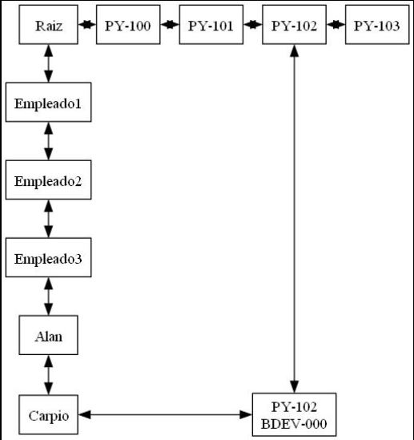
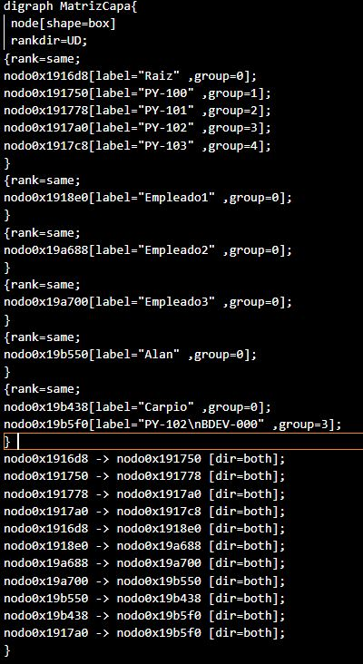

# Proyecto Fase 1
Para este proyecto se realizo ciertas estructuras de datos. Una Matriz dispersa, una cola, lista doblemente enlazada, lista doblemente enlazada circular. se utilizo la libreria graphviz para desmostracion grafica de las estructuras a continuacion se mostrara un ejemplo con la matriz dispersa.
: 

